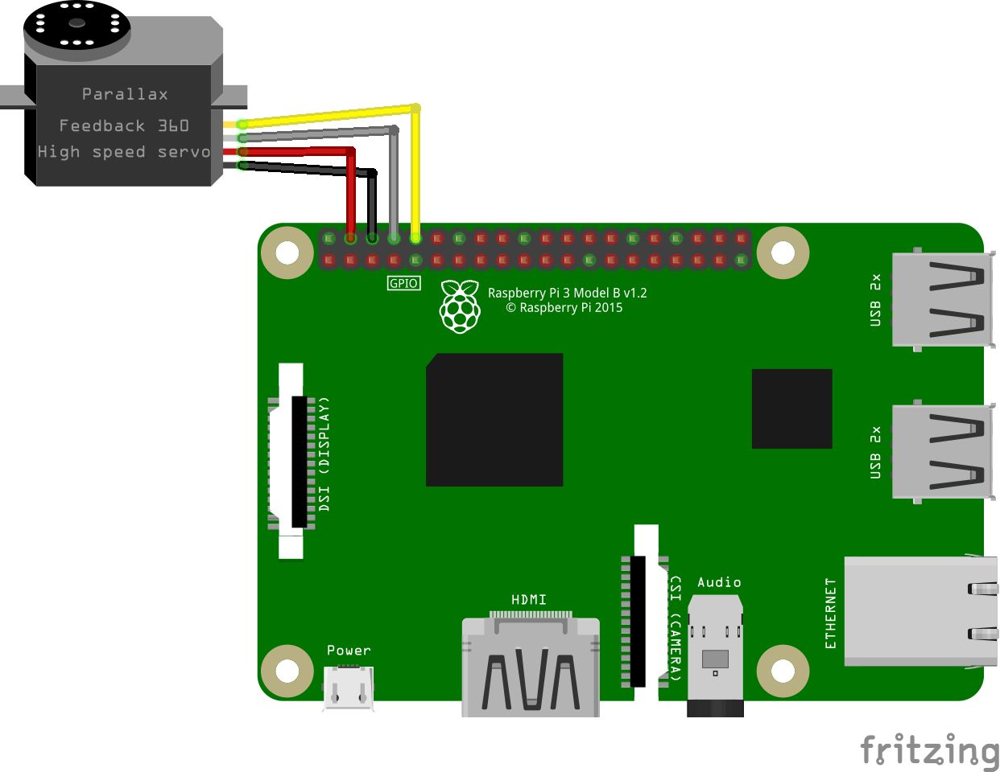
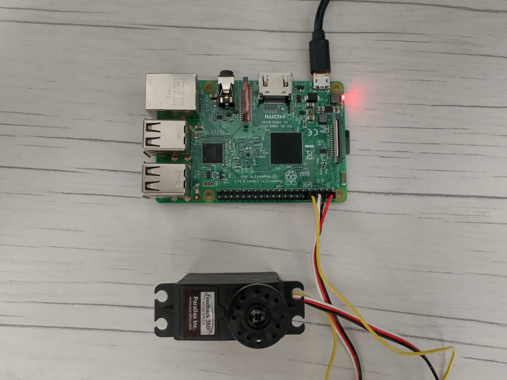

# P9-Servo

On this exercise we will control a servo with the GPIO. Although there are a few types of servo out there, we are working with a 360º continous motion servo. More precisely, with the [Parallax feedback 360 high speed servo](https://www.parallax.com/product/parallax-feedback-360-high-speed-servo/).

All servos out there have always three wires, which are

|Nº|Wire|
|---|---|
|1|VCC|
|2|Control signal|
|3|GND|

But this model comes with a fourth wire, **which is a feedback signal**. That means that we can precisely know the position of the axle in any given moment. Cool!

You might want to take a look on the [wiki](https://github.com/clases-julio/p9-servo-dgarciac2021/wiki), since there is info about everything involved on this exercise, from [the servo itself](https://github.com/clases-julio/p9-servo-dgarciac2021/wiki/Parallax) to [PIGPIO](https://github.com/clases-julio/p9-servo-dgarciac2021/wiki/PIGPIO), a library used to manage PWM signal easily on the Raspberry Pi!

## Circuit Assembly

We got a little bit creative (and destructive) here. The assembly will be so simple if only the wire order of the connector meets the GPIO order! You see, there's three pins in a row in the RPI which are 5V, GND and GPIO14 respectively. [We have already talked about GPIO's here](https://github.com/clases-julio/p1-introrpi-pwm-dgarciac2021/wiki/GPIO). There we see that those pins are **(BOARD mode!) numbers 4, 6 and 8.**

However, the original connector of the servo comes in the following arrangement: VCC, Control Signal and GND. *Damnit*!

We will have to connect it to the protoboard and do the wiring there, just for one pin! Unless... We change the conector to our needs. Here's a picture of a similar connector:


Inside the plastic housing there is three small metal pieces which serve as contact points, fixing themselves in place with the male pins by pressure. You can see this pieces here:


This metal pieces are held to the plastic housing by a tiny flange that can be manipulated with caution without breaking, and thus free the metal piece of each wire. Then is just as easy to put it back together in the right order. Here you can see a more detailed picture of where the plastic housing holds the metal piece:


Fortunately for us, the feedback wire comes in a separate housing and we can conncet it at any GPIO, but for a clean view we are connecting it to the next GPIO, the **GPIO15**.

This is an schematic made with [Fritzing](https://fritzing.org/) (Actually the servo was not on the database of Fritzing, so we gone to make our own part, you can check it out [here](./res/fritzing/)):



And this is the real circuit!



## Exercise sctructure 

Although the exercise script tells us to follow a few guidelines to do each program, we did it our [own way](https://www.youtube.com/watch?v=qQzdAsjWGPg).

The first exercise consists on find the most accurate values to drive the servo in order to find the slowest and fastest rotation speed... by hand. *By hand?* So why are we studying software engineering then? The manufacturer give us the oportunity to tweak with a feedback signal, so let's use it!

The whole process of calibration is condensed in a `class`, you can find it [here](src/parallax.py), we tryied to do our best in the documentation and comments to explain the whole process, but in a nutshell it has three main stages:

1. Find the minimum and maximum reading possible, since the feedback pin p**rovides us a PWM signal which its duty cycle representes the angular position of the axle**.
2. Find the minimum control signal (A.K.A Pulse width) in which the servo will start moving in either directions. We start from a known "stop position", and gradually increase (or decrease) the pulse width of the control signal until we read a change in the angular position of the axle, meaning that the servo started moving. Cool!
3. Find the maximum control signal (A.K.A Pulse width) in which the servo will start decelerating from maximum speed in either directions. We start from a known "fast position", and gradually increase (or decrease) the pulse width of the control signal until we read a change in the speed of the axle, meaning that **the previous** control signal was the real maximum (Since the current signal made the servo go slower). Cool!

**This whole process take less than three minutes**, and it is done before the execution of the main program. We use a scale from 0 to 100 in order to represent the speed of the servo, and in our tests we found that before this calibration procedure, the servo won't start moving until a value around 10. However, after the calibration, we can drive the servo at "1" value, meaning the slowest speed posibble. Same goes for maximum speed.

Along with the class other methods are included, like run or stop the servo, set the rotation direction[^1]...

In the other hand, we have the second exercise, which encourage us to drive the servo by writting the desired value by keyboard. Actually what we did its some kind of "slider", in which you can gradually increase or decrease the speed by hitting <kbd>A</kbd> or <kbd>D</kbd> on the keyboard, also keeping the functionality of <kbd>Ctrl</kbd> + <kbd>C</kbd> to exit the program!

Both programs are documented well enough (And comment them here will take forever) except of the "slider" draw, so let's talk about it!

## Code

```python3
def draw_gauge(value):
    start_str = "min |"
    end_str = "| max (Power: " + str(value) + "%)"

    total_char_count = 80

    max_width = total_char_count - (len(start_str) + len(end_str))

    represented_value = round(max_width * ((value - MIN_POWER)/(MAX_POWER - MIN_POWER)))

    print(start_str, end="")

    for i in range (0, max_width + 1):
        if i == represented_value:
            print("¤", end="")
        else:
            print(" ", end="")

    print(end_str, end="\r")
```

First of all, this "slider" will have a start and an end, both taking char width, so we have to take in consideration. Next we determine the maximum width of the whole slider (**In chars!**). Substracting the length of the start and end strings to the maximum char count gives us the chars left *we have to paint*.

Then we perfom a linear escale to reduce the value given (Which can go from `-100` to `100`) from `0` to the chars we have left, calculated earlier. This will give us the position where the indicator should be printed. The rest of characters should be filled with spaces and we are done!

This is perfomed on the `for` loop, the real trick comes in how we tell `Python` to end the printed string, with the parameter `end=`. We can set it to be nothing at all, maybe a carriage return... That carriage return is key, since once the whole gauge is printed we will return the cursor to the start of the line, ready to overwrite the next gauge on the next call. **Since the char width will remain constant**, this will give us the illusion of a moving slider. Cool!

<p align="center">
  
</p>

## External code

We are using [PIGPIO](https://abyz.me.uk/rpi/pigpio/) which according to their authors...

> is a library for the Raspberry which allows control of the General Purpose Input Outputs (GPIO).  pigpio works on all versions of the Pi.

In this case we are using it to control the PWM signals in an easy way. For example, it allows us to write a PWM signal by its desired Pulse Width according to certain parameters, very handy.

Some other code used in this exercise, like de [PWM reader](./src/read_PWM.py), is exactly an [example found on the PIGPIO documentation](https://abyz.me.uk/rpi/pigpio/examples.html). So there is no point to explain them here since they have their own documentation as said!

However one important thing to note is what does actually this line do:

```bash
sudo pigpiod
```
According to the documentation...

> The pigpio library is written in the C programming language. The pigpio daemon offers a socket and pipe interface to the underlying C library. A C library and a Python module allow control of the GPIO via the pigpio daemon.

Wow! So that's why nothing works if you do not launch the daemon first! Interesting...

## Circuit testing

This is the result! Pretty nice, isn't it?

### You can actually click on the preview to view a video of the circuit!

[](https://www.youtube.com/watch?v=aeIq6lUed1c "P9 - Servo Demo")

[^1]: The class itself is currently under development so it lacks of a few features, like value validation, but deadline approaches!
